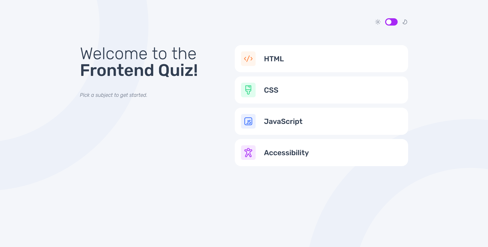
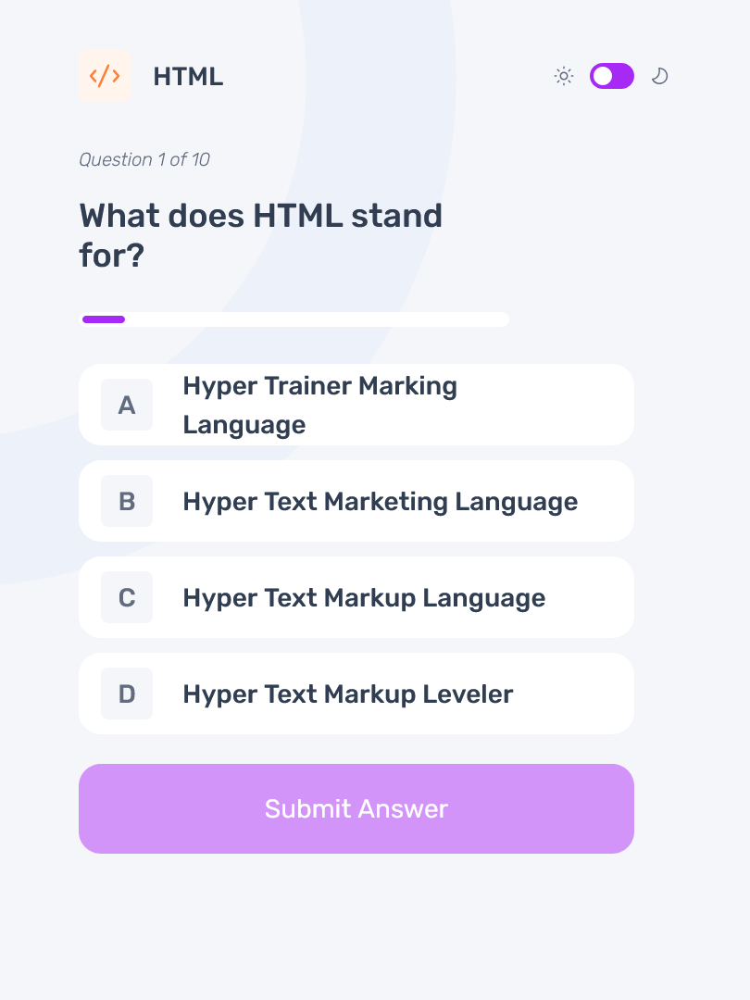
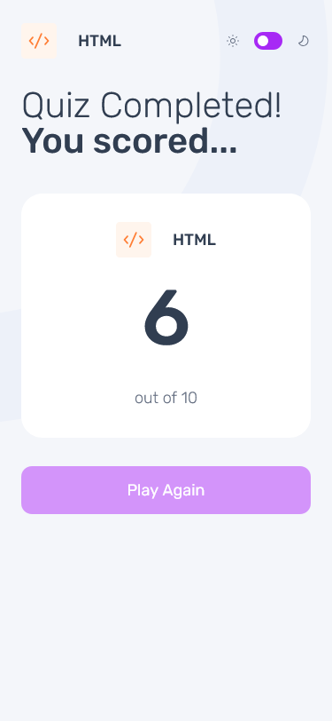

# Frontend Mentor - Frontend quiz app solution

This is a solution to the [Frontend quiz app challenge on Frontend Mentor](https://www.frontendmentor.io/challenges/frontend-quiz-app-BE7xkzXQnU). Frontend Mentor challenges help you improve your coding skills by building realistic projects.

## Table of contents

- [Overview](#overview)
  - [The challenge](#the-challenge)
  - [Screenshot](#screenshot)
  - [Links](#links)
- [My process](#my-process)
  - [Built with](#built-with)
  - [What I learned](#what-i-learned)
  - [Continued development](#continued-development)
  - [Useful resources](#useful-resources)
- [Author](#author)
- [Acknowledgments](#acknowledgments)

## Overview

### The challenge

Users should be able to:

- Select a quiz subject
- Select a single answer from each question from a choice of four
- See an error message when trying to submit an answer without making a selection
- See if they have made a correct or incorrect choice when they submit an answer
- Move on to the next question after seeing the question result
- See a completed state with the score after the final question
- Play again to choose another subject
- View the optimal layout for the interface depending on their device's screen size
- See hover and focus states for all interactive elements on the page
- Navigate the entire app only using their keyboard

### Screenshot

#### Desktop

#### Tablet

#### Mobile

### Links

- Solution URL: [https://github.com/PetarR21/frontend-quiz-app](https://github.com/PetarR21/frontend-quiz-app)
- Live Site URL: [https://quiz-app-frontend-theta.vercel.app/](https://quiz-app-frontend-theta.vercel.app/)

## My process

### Built with

- Semantic HTML5 markup
- CSS custom properties
- Flexbox
- CSS Grid
- [React](https://reactjs.org/) - JS library
- [Express.js](https://expressjs.com/) - For the backend

### What I learned

I learned a lot in this challenge, especially about managing state in React applications and how to handle user interactions effectively. I also improved my skills in using CSS Grid and Flexbox for responsive design.

### Continued development

I would like to continue improving. I also want to explore more advanced CSS techniques for styling and layout, and to find a way to make the code more modular and reusable.

Also, I would like to improve my code in the future so it is more clean and simple.

## Author

- Frontend Mentor - [@PetarR21](https://www.frontendmentor.io/profile/PetarR21)
